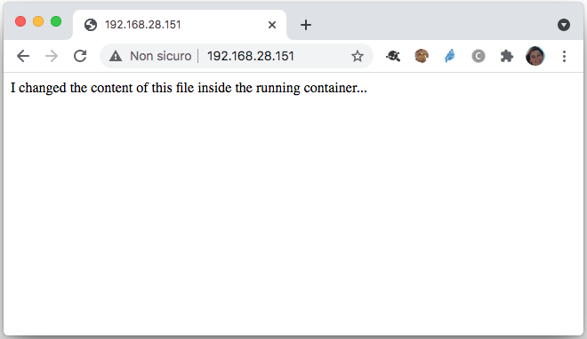
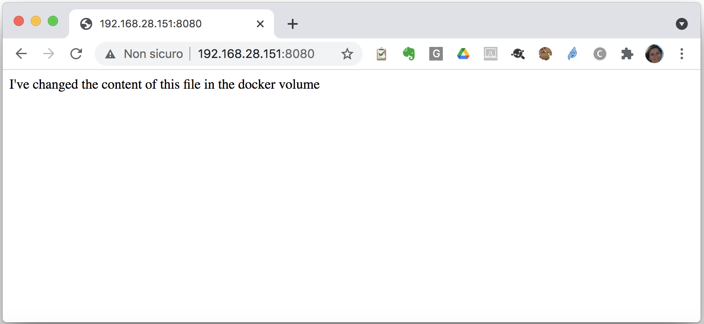
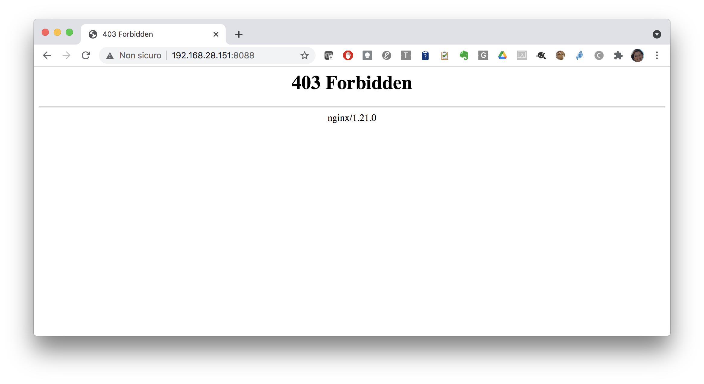
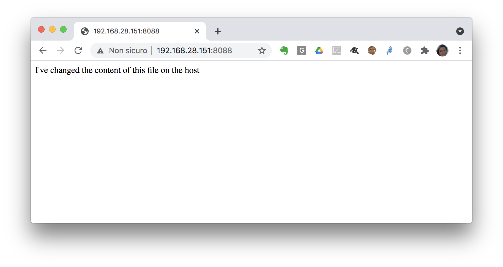

# Docker volumes

Whenever a running container wants to write data, it actually put that data into the writable layer through a storage driver.

We will now do some tasks using volumes. 

Let's create a volume:
#### Command
```bash
docker volume create volume1
```
#### Output
```bash
volume1
```

and check that the volume has been created:
#### Command
```bash
docker volume ls
```
#### Output
```bash
DRIVER    VOLUME NAME
local     volume1
```

Let's do the same with a second volume:
#### Command
```bash
docker volume create volume2
```
#### Output
```bash
volume2
```

and check:
#### Command
```bash
docker volume ls
```
#### Output
```bash
DRIVER    VOLUME NAME
local     volume1
local     volume2
```

Let's now remove the second volume we've created:
#### Command
```bash
docker volume rm volume2
```
#### Output
```bash
volume2
```

and check that it has actually been removed
#### Command
```bash
docker volume ls
```
#### Output
```bash
DRIVER    VOLUME NAME
local     volume1
```

Now let's dive into real-life (or quasi-real-life) usage of Docker volumes.

`docker container run -d -p 80:80 --name nginx2 nginx`

Let’s use the `docker exec` command to edit the welcome page and load it.

```bash
docker container exec -it nginx2 bash
```
This wil open a bash shell and now you should now be inside your container. Run the following command to change the welcome page:

```bash
echo "I changed the content of this file inside the running container..." > /usr/share/nginx/html/index.html
```

You will be able to see these changes connecting to the port 80 of your host:



Alternatively:
```bash
curl localhost:80
```
Instead of 80 use the same number you defined above with -P NNN:80

Let’s restart the container:
```bash
docker container restart nginx2
```

What happens? We can still see in the browser the changes that we made. 

Now... what if we stop this container and start another one and load the page?

```bash
docker container run -d -p 8080:80 --name nginx3 nginx
```
!!! warning
    For this second container you need to specify a different host port, otherwise there will be a conflict and your container will not be started:
 
    `driver failed programming external connectivity on endpoint nginx3 (96fad8e096e1a124147049765f0d734e2a034712fb253711450c62a7158b1f21): Bind for 0.0.0.0:80 failed: port is already allocated.`


Connect to port 8080 of your host, you will see the default welcome page: there is no way that we could access the file that we have changed in another container.


### Using docker volumes

Let's now create a docker volume to be used with our nginx container:

```bash
docker volume create myvol
```

We can see the location of volumes in the docker area of the host file system with the inspect command:

```bash
docker volume inspect myvol
```

whose output contains the following information:
```bash
[
    {
        "CreatedAt": "2021-06-07T10:53:26Z",
        "Driver": "local",
        "Labels": {},
        "Mountpoint": "/var/lib/docker/volumes/myvol/_data",
        "Name": "myvol",
        "Options": {},
        "Scope": "local"
    }
]
```

Let's re-create our `nginx` container with the following command that mounts the volume `myvol` in `/usr/share/nginx/html`:

Remove the old container (please note that the `-f` or `--force` flag is needed to delete a running container; otherwise, we should `docker container stop nginx3` first, then `docker container rm nginx3`):
```bash
docker container rm -f nginx3
```

Recreate it with the volume mounted, using the `--mount` directive as in the following:
```bash
docker container run -d -p 8080:80 --name nginx3 --mount type=volume,source=myvol,destination=/usr/share/nginx/html nginx
```

##### Note
>    - if we hadn’t create the volume earlier, docker would have created it for us with the name given in source field of `--mount` parameter
>    - remember that volumes are not deleted when we erase the container which they are attached to
>    - if the container has got in `target` directory any files, this files will be copied into the volume

Now let's enter the container and modify the welcome page (the `index.html` file served by nginx by default, located at `/usr/share/nginx/html/index.html` inside the container):

```bash
docker exec -it nginx3 bash
```

Once inside the container, run the following command:

```bash
echo "I've changed the content of this file in the docker volume" > /usr/share/nginx/html/index.html
```



Let' stop and remove this container::

```bash
docker rm -f nginx3
```
and create a new one with the same command:
```bash
docker container run -d -p 8080:80 --name nginx3 --mount type=volume,source=myvol,destination=/usr/share/nginx/html nginx
```

If we load the page again we will still see the html file that we edited in the volume.

Now let's create __another__ container sharing the __same__ volume (we will now use port 8081, in order not to clash with the previous container): 
```bash
docker container run -d -p 8081:80 --name nginx3-2 --mount type=volume,source=myvol,destination=/usr/share/nginx/html nginx
```
then check that we see the same content:
```bash
curl 192.168.28.151:8081
```

### Using bind mounts

Now we will create a container running nginx using a bind mount (with the `type=bind` directive) for the main served directory instead of a volume. 

##### Note
>   - if we didn’t create a directory on docker host earlier docker will not create it for us with `--mount` parameter, auto-creating is available only in older `--volume`
>   - bind mounts by default will not be deleted while removing the container
>   - if the container has got in `target` directory any files, this files will **NOT** be copied into bind mount directory, bind directory will cover any files in a target container directory

Try the following command:

```bash
docker container run -d -p 8088:80 --name nginx4 --mount type=bind,source=/tmp/nginx,destination=/usr/share/nginx/html nginx
```

You will get an error since the path `/tmp/nginx` does not exist on the host:
```
docker: Error response from daemon: invalid mount config for type "bind": bind source path does not exist: /tmp/nginx.
See 'docker run --help'.
```

Let's create the directory on the host:

```bash
mkdir /tmp/nginx
```

Now re-run the command for creating the container with the `/usr/share/nginx/html` directory mapped to the local (on the host) `/tmp/nginx`:

```bash
docker container run -d -p 8088:80 --name nginx4 --mount type=bind,source=/tmp/nginx,destination=/usr/share/nginx/html nginx
```

If you inspect the container:

```bash
docker container inspect nginx4
```

you will see the bind-mount:
```bash
...
            "Mounts": [
                {
                    "Type": "bind",
                    "Source": "/tmp/nginx",
                    "Target": "/usr/share/nginx/html"
                }
            ],
...
```

Connect to port `8088` on the host IP to see the result:



As you can see we get an error message from nginx as the bind-mount has overwritten the content of `/usr/share/nginx/html` (remember that the behaviour with docker volumes is different, any file inside the container is copied in the volume)

Let's now create the `index.html` file in the __host__ path `/tmp/nginx`:

```bash
echo "I've changed the content of this file on the host" > /tmp/nginx/index.html
```

Then reload the page in the browser:

 

##### Question
>    As done before, try to remove the container and recreate it with the same bind-mount...what happens?

### Lab challenge

__Goal__: create a service based on JupyterLab tool and attach a volume to the area where you store your notebooks. That will make your results persistent, regardless of how many times you recreate the container. 
